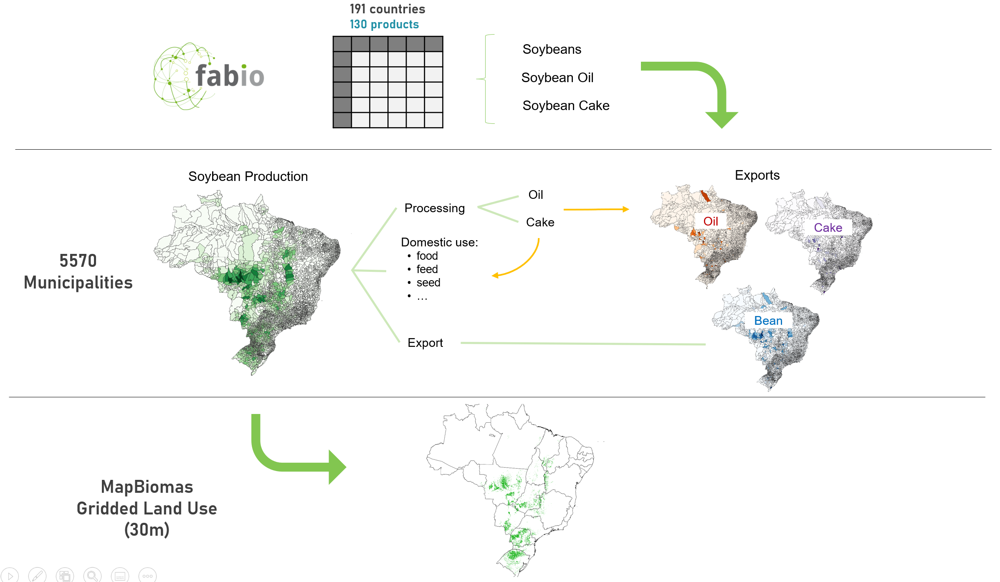

# soyprint
Mapping the land-use footprint of Brazilian soy embodied in international consumption: A spatially explicit input-output approach

 - Code files are numbered in chronological order:
   - 0-5 build the subnational data foundation
   - 6-7 model subnational transport flows
   - 8-11 connect flows to importing countries, assess model sensitivity and benchmark the "origin-to-importer" flows against trase and a pure downscaling
   - 12-19 nest the subnational supply chain flows into FABIO, adapting the existing [FABIO](https://github.com/fineprint-global/fabio) and [FABIO hybrid](https://github.com/fineprint-global/fabio-hybrid) code
   - 20-21 compute land-use footprints on the municipal level and refine them to the grid level (30m) using [MapBiomas](https://mapbiomas.org/) data. The soy land-use tiles are downloaded from Google Erath Engine, using an [adapted version](https://code.earthengine.google.com/969e903c53a0bf85db4f1e804a5c3b32) of the official MapBiomas [user toolkit](https://github.com/mapbiomas-brazil/user-toolkit).

 - As many input files are quite large, please download them [here](shorturl.at/mqwO1)

----
 
